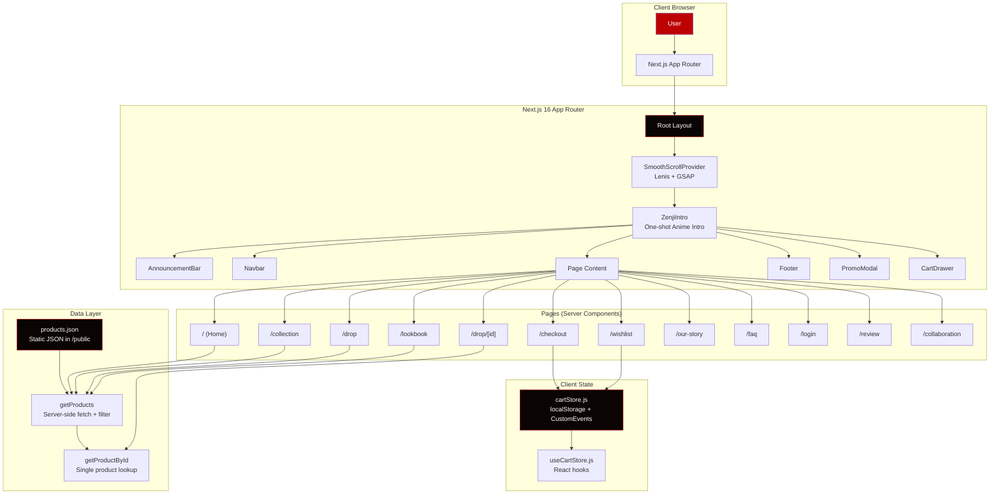
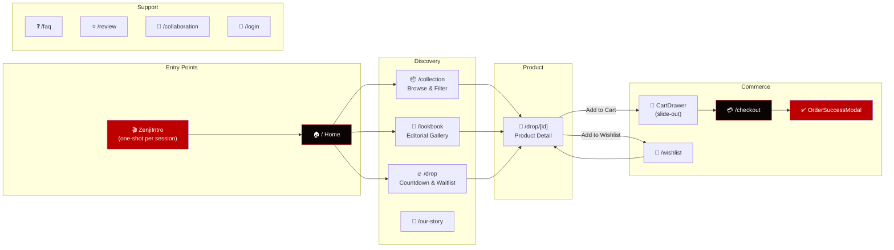
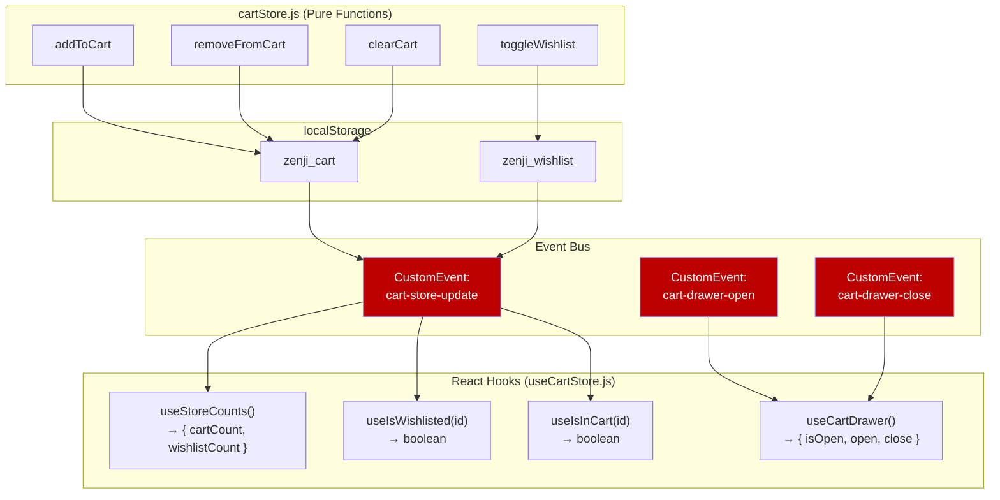

<p align="center">
  
</p>

<h1 align="center">ZENJI — Anime Streetwear Australia</h1>

<p align="center">
  <strong>Japanese-inspired anime streetwear born from warrior spirit.</strong><br/>
  Limited production runs, engineered to endure, impossible to forget.
</p>

<p align="center">
  <a href="https://zenji-lingkon.vercel.app/">🌐 Live Demo</a> &nbsp;·&nbsp;
  <a href="https://github.com/LingkonDash/zenji">📦 Repository</a> &nbsp;·&nbsp;
  <a href="https://zenji.shop/">🏪 Original Store</a>
</p>

<p align="center">
  
  
  
  
  
</p>

---

## Table of Contents

- [Project Motive](#-project-motive)
- [Key Features](#-key-features)
- [Tech Stack](#-tech-stack)
- [Project Architecture](#-project-architecture)
- [Directory Structure](#-directory-structure)
- [Page Routes & User Flow](#-page-routes--user-flow)
- [Component Architecture](#-component-architecture)
- [State Management](#-state-management)
- [Animation System](#-animation-system)
- [Design System](#-design-system)
- [Data Layer](#-data-layer)
- [Getting Started](#-getting-started)
- [Environment Variables](#-environment-variables)
- [Deployment](#-deployment)
- [Credits](#-credits)

---

## 🎯 Project Motive

**ZENJI** is a pixel-perfect frontend recreation of [zenji.shop](https://zenji.shop/) — an Australian anime streetwear e-commerce brand. The project demonstrates advanced frontend engineering capabilities through:

- **High-Fidelity UI Reproduction** — Faithfully replicating a production-grade e-commerce storefront with attention to every visual detail, from custom anime-themed cursors to cinematic loading sequences.
- **Modern Web Performance** — Leveraging Next.js 16 App Router with React Server Components, aggressive caching, and optimized image delivery to achieve near-instant page loads.
- **Immersive Brand Experience** — Translating ZENJI's Japanese warrior ethos into a fully interactive digital experience with anime-inspired animations, canvas particle systems, and scroll-driven choreography.
- **Production-Ready E-Commerce Patterns** — Implementing a complete shopping flow including product browsing, filtering, cart management, wishlist functionality, and a full checkout experience.

The website targets anime enthusiasts, gamers, and streetwear collectors in Australia who resonate with Japanese culture and warrior aesthetics. Every design decision — from the deep black (`#0B0404`) background to the crimson red (`#BC0100`) accents — reinforces the brand's identity of controlled intensity and limited exclusivity.

---

## ✨ Key Features

| Feature | Description |
|---|---|
| **Cinematic Intro** | One-shot anime-style "big bang" loading sequence with SVG logo draw-on, shockwave rings, speed lines, and HUD counter |
| **Smooth Scrolling** | Lenis-powered buttery smooth scrolling synced with GSAP ScrollTrigger for parallax effects |
| **Dynamic Product Catalog** | Server-side rendered product grid with category filtering, search, and animated card interactions |
| **Interactive Product Pages** | Full product detail pages with image gallery, size selector, stock indicators, and accordion sections |
| **Cart System** | Slide-out cart drawer with real-time quantity management, price calculations, and free shipping threshold |
| **Wishlist** | Persistent wishlist with animated heart toggles and dedicated gallery page |
| **Checkout Flow** | Complete multi-section checkout with delivery, shipping, payment, billing, and order confirmation modal |
| **Lookbook** | Editorial-style product gallery with cinematic header and grid layout |
| **Drop System** | Countdown timer, waitlist signup, and limited-edition product showcases |
| **Custom Cursors** | Anime-themed cursor icons (Jujutsu Kaisen inspired) that change contextually |
| **Ember Footer** | Canvas-rendered particle system with floating kanji glyphs and rising ember effects |
| **Responsive Design** | Fully responsive across mobile, tablet, and desktop with accessibility considerations |
| **404 Page** | Branded error page maintaining the design language |
| **Promo Modal** | Timed promotional popup for newsletter/discount capture |

---

## 🛠 Tech Stack

### Core Framework
| Technology | Version | Purpose |
|---|---|---|
| **Next.js** | 16.3.4 | App Router, Server Components, file-based routing, image optimization |
| **React** | 19.2.8 | UI component library with React Compiler enabled |
| **React DOM** | 19.2.8 | DOM rendering layer |

### Styling
| Technology | Version | Purpose |
|---|---|---|
| **Tailwind CSS** | 4.x | Utility-first CSS with custom theme tokens |
| **PostCSS** | — | CSS processing pipeline |

### Animation & Interaction
| Technology | Version | Purpose |
|---|---|---|
| **GSAP** | 3.15 | Timeline-based animations, ScrollTrigger, entrance choreography |
| **@gsap/react** | 2.1.2 | React hooks for GSAP (`useGSAP`) |
| **Lenis** | 1.3.26 | Smooth scroll locomotion |

### Icons & Assets
| Technology | Version | Purpose |
|---|---|---|
| **Lucide React** | 1.39 | Consistent icon system (ShoppingBag, Heart, Search, etc.) |

### Typography
| Font | Weight(s) | Usage |
|---|---|---|
| **Anton** | 400 | Display headings, hero text, brand wordmarks |
| **IBM Plex Mono** | 400, 500, 600, 700 | Body text, labels, UI elements, HUD-style elements |

### Development
| Tool | Purpose |
|---|---|
| **React Compiler** (babel plugin) | Automatic memoization and performance optimizations |
| **ESLint** + `eslint-config-next` | Code quality and Next.js best practices |

---

## 🏗 Project Architecture



### Architecture Decisions

1. **Server Components by Default** — Pages like Home, Collection, Drop, and Lookbook fetch product data on the server using `async` components, reducing client-side JavaScript and improving initial load performance.

2. **Client Components for Interactivity** — Components requiring browser APIs (animations, localStorage, event listeners) are explicitly marked with `"use client"` and hydrated on the client.

3. **No External State Library** — Instead of Redux/Zustand, the app uses a custom `cartStore.js` built on `localStorage` + `CustomEvent` broadcasting. This keeps the bundle tiny while providing real-time reactivity across all components.

4. **Static Data Source** — Product data lives in `/public/data/products.json`, fetched via `fetch()` with `force-cache`. This simulates an API while enabling full SSR without a backend dependency.

5. **React Compiler Enabled** — `reactCompiler: true` in Next.js config enables automatic memoization, eliminating the need for manual `useMemo`/`useCallback` in most cases.

---

## 📁 Directory Structure

```
zenji/
├── public/
│   ├── data/
│   │   └── products.json          # Product catalog (7 items)
│   ├── images/
│   │   ├── background/            # Background textures
│   │   └── hero/                  # Hero images & product cards
│   │       └── card/              # Card-size product thumbnails
│   ├── videos/
│   │   └── hero.mp4               # Hero section background video
│   ├── cursor.png                 # Default cursor asset
│   ├── new-cursor.png             # Custom anime cursor (default)
│   ├── jujutsu-cursor.png         # Anime cursor variant
│   ├── jujutsu-pointer.png        # Anime pointer cursor (for clickables)
│   └── pointer-cursor.png         # Alternative pointer cursor
│
├── src/
│   ├── app/                       # Next.js App Router pages
│   │   ├── layout.jsx             # Root layout (fonts, global providers)
│   │   ├── page.jsx               # Home page
│   │   ├── globals.css            # Global styles, theme tokens, cursors
│   │   ├── loading.jsx            # Global loading state (GSAP animated)
│   │   ├── not-found.jsx          # Custom 404 page
│   │   ├── checkout/page.jsx      # Full checkout flow
│   │   ├── collaboration/page.jsx # Collaboration (coming soon)
│   │   ├── collection/page.jsx    # Product collection with filters
│   │   ├── drop/
│   │   │   ├── page.jsx           # Drop landing (countdown + waitlist)
│   │   │   └── [id]/page.jsx      # Individual product detail page
│   │   ├── faq/page.jsx           # FAQ page
│   │   ├── login/page.jsx         # Authentication page
│   │   ├── lookbook/page.jsx      # Editorial lookbook gallery
│   │   ├── our-story/page.jsx     # Brand story page
│   │   ├── review/page.jsx        # Customer reviews
│   │   └── wishlist/page.jsx      # Saved items page
│   │
│   ├── components/                # React components
│   │   ├── auth/
│   │   │   └── AuthCard.jsx       # Login/Register form with tabs
│   │   ├── checkout/
│   │   │   ├── CheckoutSection.jsx    # Reusable checkout section wrapper
│   │   │   └── OrderSuccessModal.jsx  # Post-order confirmation modal
│   │   ├── collection/
│   │   │   ├── CollectionFilterBar.jsx  # Category filter tabs
│   │   │   ├── CollectionGrid.jsx       # Product grid layout
│   │   │   ├── CollectionGridSkeleton.jsx # Loading skeleton
│   │   │   └── CollectionHeading.jsx    # Section header
│   │   ├── drop/
│   │   │   ├── AwakeningSection.jsx     # Drop hero/banner
│   │   │   ├── CountdownSection.jsx     # Countdown timer display
│   │   │   ├── OriginDropSection.jsx    # Featured products from the drop
│   │   │   ├── WaitlistSection.jsx      # Email waitlist signup
│   │   │   └── useCountdown.js          # Countdown timer hook
│   │   ├── faq/
│   │   │   └── FaqSection.jsx           # Accordion FAQ component
│   │   ├── home/
│   │   │   ├── Hero.jsx                 # Full-screen video hero
│   │   │   ├── HeroTwo.jsx              # Secondary hero section
│   │   │   ├── BookStackSection.jsx     # Stacked product cards
│   │   │   ├── OriginDropSection.jsx    # Origin drop showcase
│   │   │   ├── ShopSection.jsx          # Shop CTA section
│   │   │   ├── RestockSection.jsx       # Restock notification (unused)
│   │   │   └── EthosSection.jsx         # Brand ethos/values
│   │   ├── loading/
│   │   │   └── ZenjiIntro.jsx           # Cinematic intro animation
│   │   ├── lookbook/
│   │   │   ├── LookbookGallery.jsx      # Lookbook image grid
│   │   │   └── LookbookHeader.jsx       # Lookbook page header
│   │   ├── our-story/
│   │   │   └── OurStory.jsx             # Brand narrative component
│   │   ├── product/
│   │   │   ├── Accordion.jsx            # Expandable detail sections
│   │   │   ├── ProductDetails.jsx       # Product page layout wrapper
│   │   │   ├── ProductGallery.jsx       # Image gallery with zoom
│   │   │   └── ProductInfo.jsx          # Product info, sizing, add to cart
│   │   ├── providers/
│   │   │   └── SmoothScrollProvider.jsx # Lenis smooth scroll + GSAP sync
│   │   ├── review/
│   │   │   └── ReviewSection.jsx        # Customer reviews display
│   │   ├── shared/
│   │   │   ├── AnnouncementBar.jsx      # Top announcement strip
│   │   │   ├── Footer.jsx              # Footer with ember canvas
│   │   │   ├── PromoModal.jsx          # Promotional popup
│   │   │   ├── badge/
│   │   │   │   └── DiscountBadge.jsx   # Sale percentage badge
│   │   │   ├── card/
│   │   │   │   ├── AddToCart.jsx        # Add-to-cart button
│   │   │   │   ├── OriginDropCard.jsx   # Origin drop product card
│   │   │   │   ├── ProductCard.jsx      # Standard product card
│   │   │   │   └── WishlistHeart.jsx    # Animated wishlist toggle
│   │   │   ├── cart/
│   │   │   │   └── CartDrawer.jsx       # Slide-out cart sidebar
│   │   │   └── nav/
│   │   │       ├── Navbar.jsx           # Desktop navigation bar
│   │   │       └── MobileNav.jsx        # Mobile hamburger menu
│   │   └── wishlist/
│   │       ├── WishlistGallery.jsx      # Wishlist items grid
│   │       └── WishlistHeader.jsx       # Wishlist page header
│   │
│   ├── images/                    # Static image imports (logo, cursors)
│   │   ├── zenji-outlook.png      # ZENJI icon logo
│   │   └── zenji-full-outlook.png # ZENJI full logo
│   │
│   └── lib/                       # Utility functions & state
│       ├── cartStore.js           # Cart & Wishlist localStorage store
│       ├── useCartStore.js        # React hooks for cart/wishlist state
│       ├── getProducts.js         # Product data fetching & filtering
│       └── product/
│           ├── getProductById.js  # Single product lookup
│           └── formatters.js      # Price & discount formatters
│
├── .env                           # Environment variables
├── next.config.mjs                # Next.js configuration
├── package.json                   # Dependencies & scripts
├── postcss.config.mjs             # PostCSS configuration
├── eslint.config.mjs              # ESLint configuration
└── jsconfig.json                  # Path alias configuration (@/)
```

---

## 🗺 Page Routes & User Flow



### Route Details

| Route | Type | Description |
|---|---|---|
| `/` | Server | Home page — Hero video, BookStack, Origin Drop, Shop section, Ethos |
| `/collection` | Server | Full product catalog with category filter bar (All, Sale, New Arrival, etc.) and search |
| `/collection?category=sale` | Server | Filtered collection view |
| `/drop` | Server | Awakening Drop landing — countdown timer, featured products, waitlist signup |
| `/drop/[id]` | Server | Individual product page — gallery, sizing, fabric notes, add to cart |
| `/lookbook` | Server | Editorial-style product gallery with search parameter support |
| `/checkout` | Client | Full checkout form — delivery, shipping, payment, billing, order summary |
| `/wishlist` | Client | Saved products from localStorage |
| `/our-story` | Server | Brand narrative and founding story |
| `/faq` | Client | Frequently asked questions with accordion UI |
| `/review` | Client | Customer review display |
| `/collaboration` | Server | Coming soon placeholder page |
| `/login` | Server | Authentication page with login/register tabs |

---

## 🧩 Component Architecture

### Layout Hierarchy

```
RootLayout
├── SmoothScrollProvider          ← Lenis smooth scroll + GSAP ticker sync
│   └── ZenjiIntro                ← Cinematic anime intro (session-gated)
│       ├── AnnouncementBar       ← Scrolling promo text strip
│       ├── Navbar                ← Desktop nav + MobileNav
│       ├── <main>{children}</main>  ← Page-specific content
│       ├── Footer                ← EmberCanvas + navigation + social links
│       ├── PromoModal            ← Timed promotional popup
│       └── CartDrawer            ← Slide-out cart sidebar
```

### Component Categories

#### Shared Components (Global)
Components rendered on every page via the root layout:

- **`AnnouncementBar`** — Horizontally scrolling promotional text banner at the very top
- **`Navbar`** — Sticky navigation with logo, nav links, search, wishlist count badge, cart count badge, and user icon
- **`MobileNav`** — Full-screen slide-down mobile navigation menu
- **`Footer`** — Full-width footer with `EmberCanvas` (HTML5 Canvas particle system rendering rising embers and floating kanji glyphs), navigation columns, social links, and brand messaging
- **`PromoModal`** — Timed popup for promotional offers
- **`CartDrawer`** — Slide-out sidebar showing cart items with quantity controls, subtotal, shipping threshold, and checkout link

#### Product Components
- **`ProductCard`** — Standard product card with image, title, price, discount badge, wishlist heart, and add-to-cart button
- **`OriginDropCard`** — Special card variant for Origin Drop products with background image reveal
- **`ProductGallery`** — Image gallery with thumbnail navigation and zoom capabilities
- **`ProductInfo`** — Comprehensive product information panel with size selector, stock status, fabric notes accordion, size guide table, and shipping info
- **`WishlistHeart`** — Animated SVG heart toggle with pulse effect on wishlist add
- **`AddToCart`** — Cart add button with state feedback
- **`DiscountBadge`** — Percentage-off badge calculated from price vs originalPrice

#### Page-Specific Components
- **Home**: `Hero`, `HeroTwo`, `BookStackSection`, `OriginDropSection`, `ShopSection`, `EthosSection`
- **Collection**: `CollectionHeading`, `CollectionFilterBar`, `CollectionGrid`, `CollectionGridSkeleton`
- **Drop**: `AwakeningSection`, `CountdownSection`, `OriginDropSection`, `WaitlistSection`
- **Lookbook**: `LookbookHeader`, `LookbookGallery`
- **Checkout**: `CheckoutSection`, `OrderSuccessModal`
- **Wishlist**: `WishlistHeader`, `WishlistGallery`

---

## 🔄 State Management

### Cart & Wishlist Store (`cartStore.js`)

The application uses a **custom event-driven localStorage store** — no external state management library required.



**How it works:**

1. **Write** — Any mutation (`addToCart`, `removeFromCart`, `toggleWishlist`, etc.) writes to localStorage and dispatches a `cart-store-update` CustomEvent on `window`.

2. **Subscribe** — React hooks (`useStoreCounts`, `useIsWishlisted`, `useIsInCart`) listen for the `cart-store-update` event via `useEffect` and re-read localStorage to update component state.

3. **Drawer Control** — Separate `cart-drawer-open` / `cart-drawer-close` events control the `CartDrawer` visibility without prop drilling.

This pattern provides **cross-component reactivity without context providers or global stores**, keeping the architecture simple and the bundle size minimal.

### Cart Data Shape
```json
{
  "id": "blue-flame-tee",
  "title": "Blue Flame Tee",
  "price": "A$33.99",
  "posterImage": "/images/hero/card/Blue-flame.avif",
  "qty": 2,
  "selectedSize": "M"
}
```

---

## 🎬 Animation System

The animation layer is built entirely on **GSAP 3.15** with the following orchestration:

### 1. ZenjiIntro (One-Shot Loading)
A cinematic anime-inspired intro that plays once per session (gated by `sessionStorage`):

```
Singularity dot → Big bang flash + camera shake → Shockwave rings →
Anime speed lines → SVG logo draw-on → Wordmark impact slam →
Aura pulse → HUD counter 000→100 → Wipe-away reveal
```

- Uses SVG `strokeDasharray`/`strokeDashoffset` for path draw-on effects
- Katakana glitch layer with flickering opacity
- Manga screentone dot overlay texture
- Cinematic vignette gradient for depth
- Energy ring with `conic-gradient` and CSS mask for glow orbit

### 2. Hero Section
- Video background with scale-in zoom (1.12 → 1.0)
- Eyebrow text fade-in
- Headline reveal via `yPercent: 100 → 0` (masked overflow clip)
- Staggered CTA fade-in
- Infinite scroll-cue bounce animation

### 3. Scroll-Driven Animations
- Footer elements reveal on scroll via `ScrollTrigger`
- Product cards entrance animations
- Section transitions

### 4. Page Transitions
- Checkout page uses staggered `.checkout-anim-item` entrance choreography
- Loading state with GSAP-driven logo + text animation
- `prefers-reduced-motion` checks on every animation for accessibility

### 5. EmberCanvas (Footer)
A custom HTML5 Canvas renderer painting:
- 46 rising ember particles with physics (speed, drift, sway, fade zones)
- 16% "flare" particles with tail streaks and gradient strokes
- 5 floating kanji glyphs (武, 士, 道, 龍, 影, 刃)
- IntersectionObserver-gated for performance (stops when off-screen)
- DPR-aware for Retina displays

---

## 🎨 Design System

### Color Palette

| Token | Hex | Usage |
|---|---|---|
| `--color-primary` | `#0B0404` | Deep black — backgrounds, navbar, card footers |
| `--color-secondary` | `#BC0100` | Crimson red — accents, CTAs, badges, notification dots |
| `--color-muted` | `#4B4B4B` | Dark gray — secondary labels, breadcrumbs, borders |
| `--color-subtle` | `#9D9D9D` | Light gray — strike-through prices, inactive text |

### Typography

| Variable | Font | Role |
|---|---|---|
| `--font-anton` | Anton (400) | Display headings, hero text, brand wordmarks, impact typography |
| `--font-sans` (default) | IBM Plex Mono (400-700) | Body text, labels, prices, navigation, UI elements |

### Custom Cursors

The site uses anime-themed custom cursors that enhance the brand experience:

- **Default cursor**: `new-cursor.png` — used site-wide
- **Pointer cursor**: `jujutsu-pointer.png` — used on interactive elements (buttons, links, inputs)
- **Touch devices**: Custom cursors disabled via `@media (pointer: coarse)`

### Custom Scrollbar

- **Track**: Primary black (`#0B0404`)
- **Thumb**: Crimson red (`#BC0100`) with inner glow shadow
- **Hover**: Brightened red (`#ff1a19`) with outer glow effect
- Cross-browser support (WebKit + Firefox `scrollbar-color`)

---

## 📊 Data Layer

### Product Data Model

Products are stored in `/public/data/products.json` and served as static assets:

```json
{
  "id": "blue-flame-tee",
  "title": "Blue Flame Tee",
  "collection": "THE_ORIGIN_DROP",
  "description": "Engineered in 240gsm heavyweight cotton...",
  "price": "A$33.99",
  "originalPrice": "A$39.99",
  "posterImage": "/images/hero/card/Blue-flame.avif",
  "bgImage": "/images/hero/Blue-flame.avif",
  "gallery": ["/images/hero/card/Blue-flame.avif", "/images/hero/Blue-flame.avif"],
  "colorway": "Electric Blue",
  "inStock": true,
  "sizes": [
    { "label": "XS", "inStock": true },
    { "label": "S", "inStock": true },
    { "label": "M", "inStock": true },
    { "label": "L", "inStock": true },
    { "label": "XL", "inStock": true },
    { "label": "XXL", "inStock": false }
  ],
  "fabricNotes": ["240gsm heavyweight cotton", "Oversized fit, garment washed", ...],
  "sizeGuide": [
    { "size": "XS", "chest": 42, "length": 66, "shoulder": 42 },
    ...
  ],
  "shippingNotes": ["Free shipping Australia-wide on orders over A$100", ...],
  "sku": "ZNJ-BFT-001"
}
```

### Data Fetching Functions

| Function | Location | Description |
|---|---|---|
| `getProducts(queryObj)` | `lib/getProducts.js` | Fetches all products with optional category/search filtering. Uses `force-cache` for SSR performance. |
| `getProductById(id)` | `lib/product/getProductById.js` | Finds a single product by ID from the full catalog. |
| `getDiscountPercent(price, originalPrice)` | `lib/product/formatters.js` | Calculates discount percentage between sale and original price. |

### Filtering Logic

The `getProducts` function supports these filter categories:

| Filter | Behavior |
|---|---|
| `category=all` | Returns all products |
| `category=sale` | Products where `price !== originalPrice` |
| `category=new_arrival` | First 4 products |
| `category=limited` | Products matching "limited" in title/description |
| `category=zangetsu` | Products matching "zangetsu", "blade", or "demon" |
| `category=<other>` | Matches against `collection` field or title/description |
| `q=<search>` | Full-text search across title, description, and collection |

---

## 🚀 Getting Started

### Prerequisites

- **Node.js** 18.17 or later
- **npm** 9+ (or yarn/pnpm)

### Installation

```bash
# Clone the repository
git clone https://github.com/LingkonDash/zenji.git
cd zenji

# Install dependencies
npm install

# Set up environment variables
cp .env.example .env
# Edit .env with your BASEURL (see Environment Variables section)

# Start development server
npm run dev
```

The app will be available at `http://localhost:3000`.

### Available Scripts

| Command | Description |
|---|---|
| `npm run dev` | Start development server with hot reload |
| `npm run build` | Create optimized production build |
| `npm run start` | Start production server |
| `npm run lint` | Run ESLint checks |

---

## 🔐 Environment Variables

| Variable | Required | Default | Description |
|---|---|---|---|
| `BASEURL` | ✅ | — | Base URL for fetching product data (e.g., `https://zenji-lingkon.vercel.app`) |

Create a `.env` file in the project root:

```env
BASEURL=https://zenji-lingkon.vercel.app
```

> **Note**: For local development, you can use `BASEURL=http://localhost:3000` since the products JSON is served from the `/public` directory.

---

## ☁ Deployment

The project is deployed on **Vercel** with zero configuration:

- **Live URL**: [https://zenji-lingkon.vercel.app/](https://zenji-lingkon.vercel.app/)
- **Platform**: Vercel (automatic Next.js detection)
- **Build Command**: `next build`
- **Output**: Serverless functions + static assets

### Deploy Your Own

[](https://vercel.com/new/clone?repository-url=https://github.com/LingkonDash/zenji)

1. Fork this repository
2. Import to Vercel
3. Set the `BASEURL` environment variable to your deployment URL
4. Deploy

---

## 📄 Credits

- **Original Brand**: [ZENJI](https://zenji.shop/) — Anime Streetwear Australia
- **Frontend Recreation**: [Lingkon Dash](https://github.com/LingkonDash)
- **Framework**: [Next.js](https://nextjs.org/) by Vercel
- **Animations**: [GSAP](https://greensock.com/) by GreenSock
- **Smooth Scroll**: [Lenis](https://lenis.darkroom.engineering/) by Darkroom
- **Icons**: [Lucide](https://lucide.dev/)

---

<p align="center">
  <sub>Built with ❤️ and warrior spirit by Lingkon Dash. Every drop is final. No restocks. Ever.</sub>
</p>
